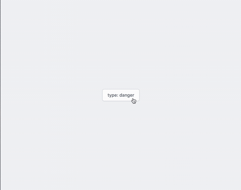

<p align="center">
  
</p>

[](https://www.npmjs.com/package/tv-modal)
[](https://nuxtjs.org)

[](https://www.npmjs.com/package/tv-modal)
[](https://www.npmjs.com/package-tv-modal)
<!-- [](https://discord.gg/enn4S6) -->

> This requires [Nuxt.js](https://nuxtjs.org) with the [Tailwind CSS](https://tailwindcss.nuxtjs.org) module

## Quick Setup
1. Add the `nuxt-tailvue` dependency to your Nuxt.js project
```bash
npm install nuxt-tailvue
# OR
yarn add nuxt-tailvue
```

2. Add `nuxt-tailvue` to the `modules` section of `nuxt.config.js`
```js
{
  modules: [
    ['nuxt-tailvue', {modal: true}],
  ]
}
```

3. If you're using [Purge](https://tailwindcss.com/docs/controlling-file-size), add this module to the content section of `tailwind.config.js`

```js
module.exports = {
    content: [
      'node_modules/tv-*/dist/tv-*.umd.min.js',
  }
```

## Usage

- Actions are buttons from [tv-button](https://github.com/acidjazz/tv-button)
- Combining toasts from [tv-toast](https://github.com/acidjazz/tv-toast)

```js
 this.$modal.show({
    type: 'danger',
    title: 'This is the title property',
    body: 'This is the body property.  Lorem ipsum, dolor sit amet consectetur adipisicing elit. Eius aliquam laudantium explicabo pariatur iste dolorem animi vitae error totam.',
    primary: {
      label: 'Primary Action',
      theme: 'red',
      action: () => this.$toast.success('Primary Button clicked'),
    },
    secondary: {
      label: 'Secondary Button',
      theme: 'white',
      action: () => this.$toast.info('Clicked Secondary'),
    },
  })
```

<p align="center">
  
</p>


## Options

### `type` __String__
 - Optional, Default: info
 - Acceptable: success, info, danger, warning
### `title` __String__
 - Optional, Default: false
### `body` __String__
 - Required
### `primary` __Object__
 - Optional, Default: false
 - Example: { label: 'Button Face', theme: 'indigo-light', action: () => console.log('clicked') }
### `secondary` __Object__
 - Optional, Default: false
 - Example: { label: 'Button Face', theme: 'indigo-light', action: () => console.log('clicked') }
 
